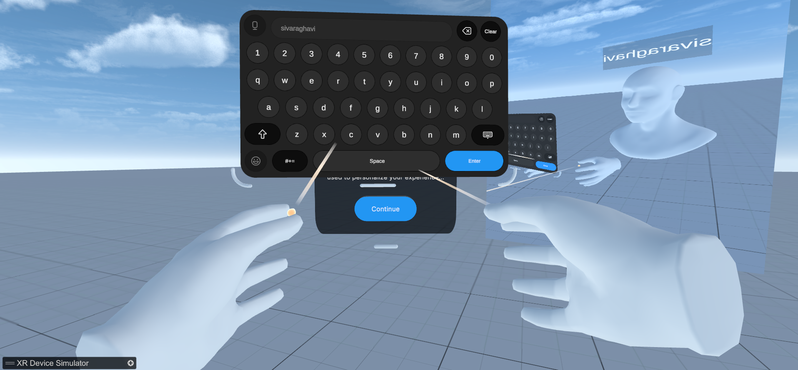

# Multiplayer Virtual Reality with Spectator using Normcore 

An immersive multiplayer experience in virtual environments with support for  spectatorship

---

## About
This project presents a virtual reality multiplayer system where users can collaborate in shared 3D environments. It includes features such as synchronized object interaction, avatar customization, and dynamic environment switching. A unique VR Spectator Mode allows users to view ongoing sessions from an observer’s perspective, adding a new layer of engagement and usability.

The goal is to enhance collaborative learning and interactive showcases in fields like training, simulation, and virtual showrooms. The intended audience includes XR developers, educators, and simulation designers.

[](https://youtu.be/Rlizt6l1Gu4)

Demo Video (VR Multiplayer): [Watch Demo](https://youtu.be/Rlizt6l1Gu4)

Demo Video (Spectator Mode): [Watch Demo](https://youtu.be/cqKkjL-icfQ)

R&D Document: [RND.docx](./RND.docx)

Knowledge Transfer Document: [Knowledge Transfer.docx](./KnowledgeTransfer.docx)

## Quick Start

1. Prerequisites:
   - Unity Editor: Version `2022.3.55f1` 
   - Blender (for 3D modeling)
   - Normcore (for Networking) 
   - Git (Ensure Git LFS is installed)

   Note: To install Git LFS, run `winget install GitHub.GitLFS`, then in your project directory run `git lfs install`. <!-- Git lfs is important to sync large files with git -->

2. Clone the Repository:

   ```bash
   git clone https://github.com/Sivaraghavi/Multiplayer-Virtual-Reality-with-Spectator-using-Nomrcore.git
   cd Multiplayer-Virtual-Reality-with-Spectator-using-Nomrcore
   ```

3. Open the cloned folder using Unity Hub.

## 4. Run:

1. **Create a Normcore Account:**
   - Go to [https://normcore.io](https://normcore.io) and sign up.
   - Create a new app in your dashboard.
   - Copy the generated **App ID** (API key).

2. **Add API Key to Unity Project:**
   - In the Unity Editor, open the asset:
     ```
     Assets/Scenes/Flow/New Normcore App Settings.asset
     ```
   - Paste the App ID into the **App Key** field in the Inspector window.

3. **Open the Main Scene:**
   - Load the following scene from Unity Hub or Project Window:
     ```
     Assets/Scenes/Flow/Multiplayer-Virtual-Reality-with-Spectator-using-Normcore.unity
     ```

4. **Play the Scene:**
   - Click the ▶️ **Play** button in the Unity Editor to start the multiplayer VR experience.


---
## Features

- 🔗 **Real-time multiplayer using Normcore:** Seamless interaction between multiple VR users in a shared environment.
- 🎭 **Avatar customization with name tags:** Users can choose colors and personalize name tags visible to others.
- 📦 **Synchronized object interaction:** Objects behave consistently across all connected users with low latency.
- 🌐 **Dynamic environment switching:** Host can switch scenes (Hospital, Nature, Showroom) for all users in real-time.
- 👁️ **VR Spectator mode:** Allows one or more users to observe the session from a third-person perspective in VR.

---
## Dependencies <!-- (Extra Tools/Frameworks/Packages) -->

- **Unity Packages:**
  - XR Interaction Toolkit
  - OpenXR Plugin
  - TextMesh Pro

- **External Tools:**
  - **Normcore** – for real-time multiplayer networking
  - **Blender** – for 3D modeling and asset creation

- **Other Tools:**
  - Git LFS – for syncing large files like models and scenes


---

## Project Structure Overview

```
MyProject/                     # Root directory
├── Assets/                    # Core Unity assets
│   ├── Scenes/                # .unity scene files
│   │   ├── 0_PreGame.unity    # Customization UI scene
│   │   ├── 1_CommonRoom.unity # Main multiplayer room
│   │   ├── 2_Showroom.unity   # Showroom environment
│   │   ├── 3_Clinic.unity     # Clinic environment
│   │   └── 4_Nature.unity     # Nature environment
│   ├── Scripts/               # C# scripts
│   │   ├── PreGameCustomization.cs # UI for name/color/room
│   │   ├── CustomizationData.cs    # Stores player data
│   │   ├── NetworkedAvatar.cs      # Avatar sync and XR Rig linking
│   │   ├── RoomManager.cs          # Room and scene management
│   │   ├── SceneSwitchPanel.cs     # Creator scene-switch UI
│   │   └── SyncGrab.cs             # Networked object grabbing
│   ├── Prefabs/               # Prefab templates
│   │   ├── AvatarPrefab.prefab    # Player avatar
│   │   ├── SpherePrefab.prefab    # Networked sphere
│   │   └── CubePrefab.prefab      # Networked cube
│   ├── Art/                   # Models, textures, sprites
│   ├── Audio/                 # Sound effects & music
│   └── Materials/             # Shaders & materials
│       ├── Red.mat            # Red avatar material
│       ├── Blue.mat           # Blue avatar material
│       ├── Green.mat          # Green avatar material
│       ├── Yellow.mat         # Yellow avatar material
│       └── Cyan.mat           # Cyan avatar material
├── Builds/                    # Compiled game builds
├── RND.docx                   # R&D document
├── KnowledgeTransfer.docx     # Knowledge-Transfer document
├── Packages/                  # Unity package dependencies
├── ProjectSettings/           # Unity configuration files
├── .gitignore                 # Git ignore rules
└── README.md                  # This file
```

---

## Configuration

| Setting | Location | Description | Default Value |
| --- | --- | --- | --- |
| Normcore App Key | `Assets/Scenes/Flow/New Normcore App Settings.asset` | App Key for Normcore multiplayer networking. Obtain from normcore.io dashboard. | `""` |
| Avatar Color Materials | `PreGameCustomization` Script (Inspector) | Array of materials for avatar color options (Red, Blue, Green, Yellow, Cyan). | 5 materials in `Assets/Materials` |
| Object Prefab Names | `RoomManager` Script (Inspector) | List of networked object prefabs to spawn (e.g., SpherePrefab, CubePrefab). | `["SpherePrefab", "CubePrefab"]` |
| Popup Fade Duration | `RoomManager` Script (`FadePopup` method) | Duration of popup message fade-in/out animation. | `0.5f` |
| XR Rig Tag | `XR Origin (XR Rig)` GameObject | Tag used to find XR Rig for avatar linking. | `XRRig` |
| Avatar Spawn Timeout | `RoomManager` Script (`CheckAvatarSpawn` method) | Time to wait for avatar spawning before error. | `5.0f` |
| Name Tag Offset | `NetworkedAvatar` Script (Inspector) | Offset of name tag above avatar’s head. | `(0, 0.2, 0)` |

---

## Contact

- **Intern:** [Sivaraghavi U.R.](https://www.linkedin.com/in/username/)
  - Email: [sivaraghavi6103@gmail.com](sivaraghavi6103@gmail.com)

- **Mentor:** Praveen Krishna
